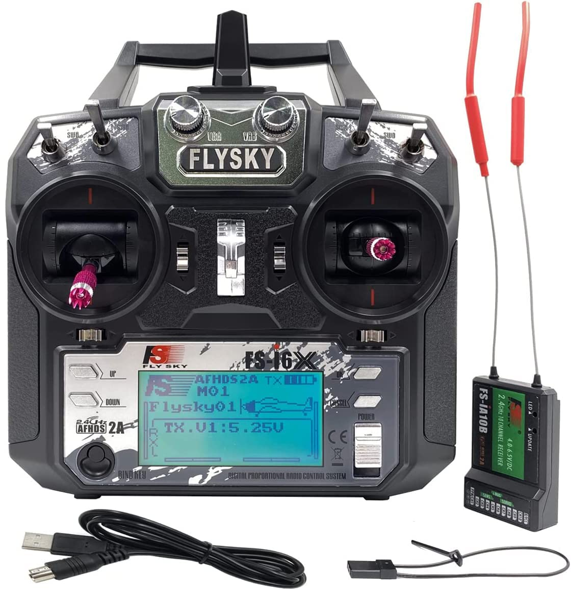
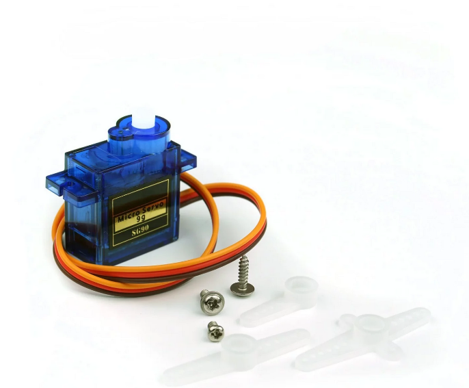
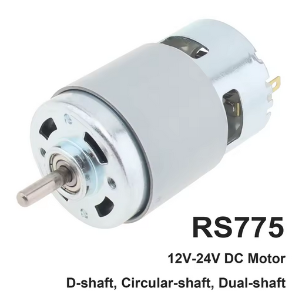
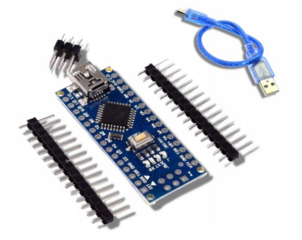

# Lista elementów elektronicznych

## 1. Aparatura z Odbiornikiem
 FlySky Aparatura FS-i6X 10CH + odbiornik FS-iA10B

---

## 2. SERVO
Serwo SG90 Tower Pro 9g serwomechanizm

---

## 3. MOTOR
775 DC Motor 12V 24V 3000RPM-12000RPM

---

## 4. ARDUINO
Moduł Nano V3 CH340 ATMEGA328P 16MHz 

