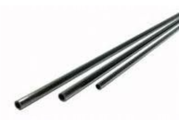
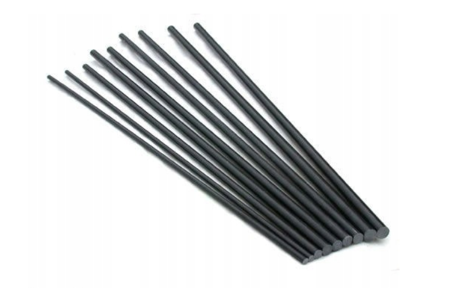
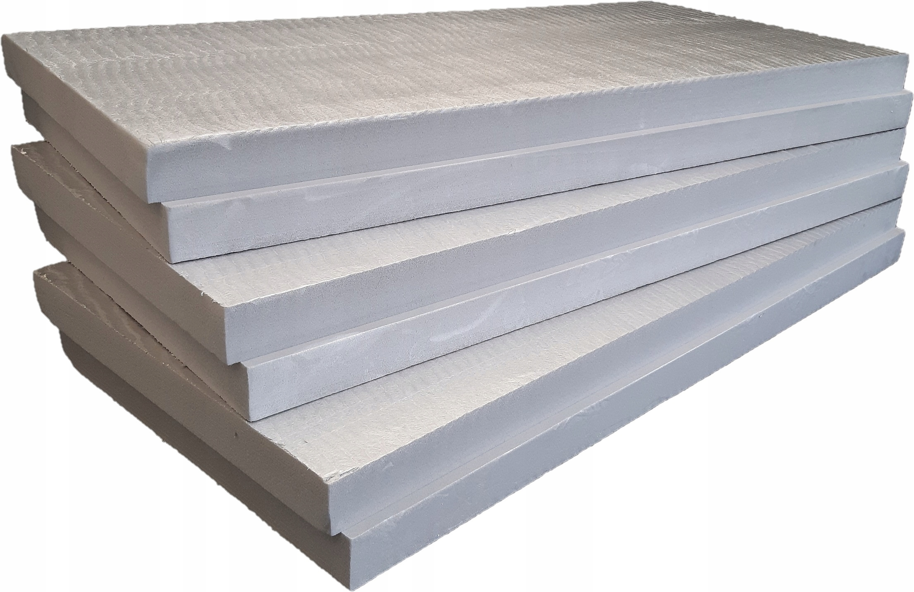
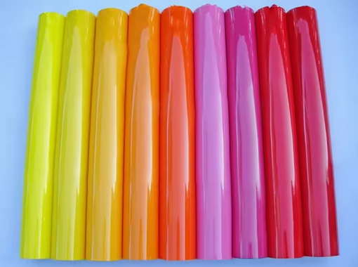
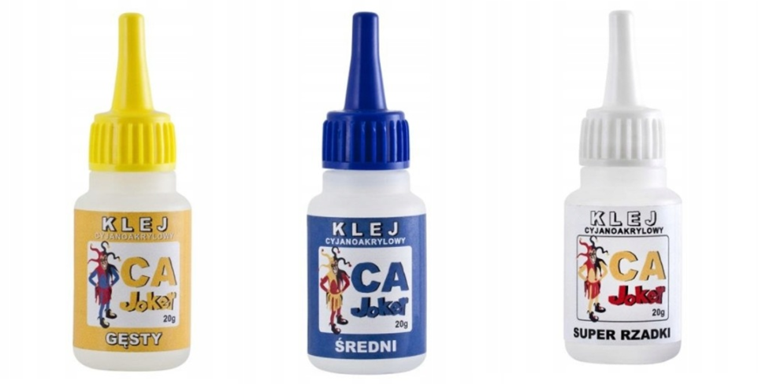

# Lista elementów konstrukcji

## 1. Rurka węglowa
**Przekroje:** |8/6| |5/3,5| oraz jedna |14/10|

---

## 2. Pręt węglowy

---

## 3. Materiał
Styrodur

---

## 4. Obudowa
Folia termokurczliwa

---

## 5. Rozklejacz
Rozklejacz Debonder do kleju cyjanoakrylowego

---

## 5. Klej
Kleje cyjanoakrylowe: gęsty, średki, rzadki

